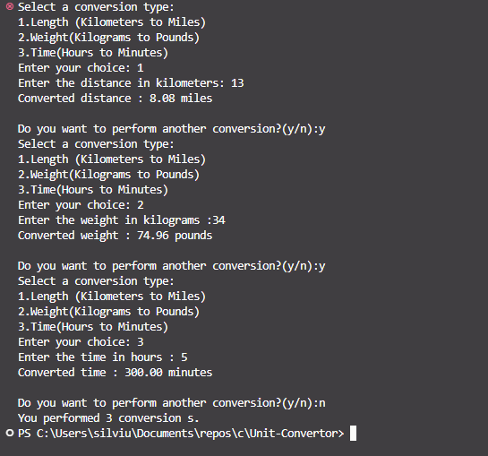

# Unit-Convertor

📌 Project Overview

This project is a Unit Converter program written in C that allows users to convert between different units of measurement such as:

Length (meters, kilometers, miles, feet, etc.)

Weight (grams, kilograms, pounds, etc.)

Time (seconds, minutes, hours, etc.)

The program takes input values from the user, asks for the desired conversion type, and outputs the converted result. It uses loops and conditional statements to manage the menu system and conversions.

⚙️ Features

Interactive menu-driven system

Supports multiple conversion categories (length, weight, time)

Repeats until the user decides to exit (using loops)

Input validation for user-friendly experience

🖥️ How It Works

The program displays a menu with conversion options.

The user selects a category (length, weight, or time).

The program asks for the input value and target unit.

Based on the selection, the program performs the calculation using conditional statements (if, else if, switch).

The result is displayed.

The user is prompted to perform another conversion or exit.

🛠️ Requirements

C compiler (e.g., GCC)

Works on Windows, Linux, or macOS
